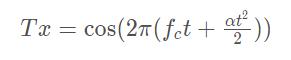
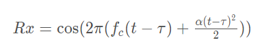
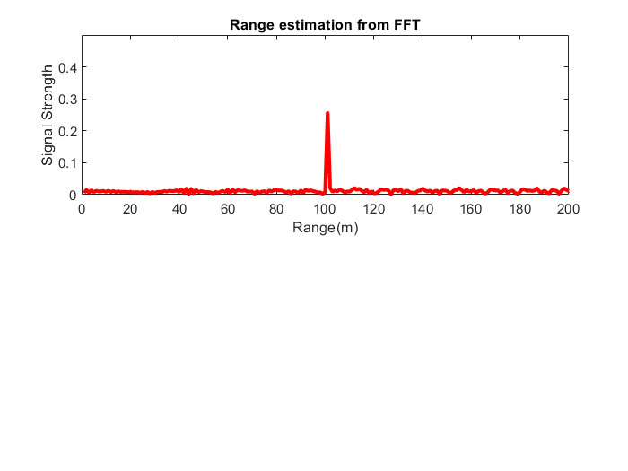
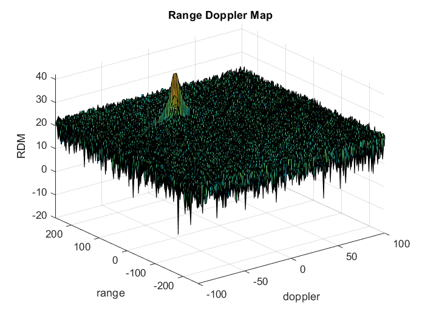
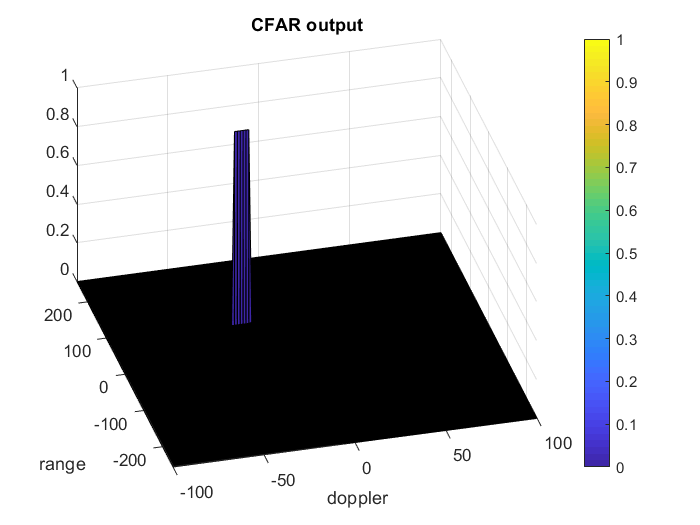

# RADAR Target Generation and Detection

The project covers the following :
* FMCW Configuration
* Moving Target Generation
* Signal Propagation
* Processing Received Signal
* Doppler FFT Implementation
* Detection using CFAR
---

### FMCW Configuration

The RADAR system used has the following specifications:
- Frequency : 77 GHz
- Max detectable range : 200m (-100 to 100)
- Max velocity : 70 m/s (-70 to 70)
- Range resolution : 1 m
- Velocity resolution : 3 m/s

## Target Generation and Detection

The transmitted signal is given by :

The received signal is same as the transmitted signal with a time delay and is given by :

### Target Specification
The target is considered to be at a range of 100m with a constant velocity of -20m/s.

## FFT Operation

For FFT processing, the following steps were used :
- Implementation of 1D FFT on the Mixed signal
- Normalizing the FFT output and taking the absolute value
- Extracting the first half of the normalized output as the second half is a mirror of the first

### Output

  

From the output, we can see that the target is detected at a range of 100m which is same as the target specification location.

### Range Doppler Map

  

## 2D CFAR Implementation

2D Constant False alarm rate is done to suppress noise and separate the target signal. CFAR offers advantage over setting a fixed threshold which may lead to extreme cases in false alarms.

Following parameters were chosen to implment CFAR :
- Training cell in Range dimension : 8
- Training cells in Doppler dimension: 4
- Guard cells in Range dimension: 4
- Guard cells in Doppler dimension: 2

The offset was choosen as 1.4 times, leading to a noise threshold of 1.4 times of the boise level in each grid.

Procedure:
* For the entire range doppler map except the corners, a window was slid of the grid size.
* The guard cells in this window were changed to a value of zero and average was computed.
* Based on the average, the threshold was decided as 1.4 times the average
* If the signal strength of Cell under Test (CUT) was more than the threshold, the signal was given a value of 1 at that position, 0 otherwise.
* Since the edges couldn't be passed through a threshold, all the values more than one were changed to zero. This was done by initializing the final matrix as a matrix of zeros with a size of the 2D Doppler Range map. The edges that could not be thresholded were initialized to zero in this step itself, and the signal greater than the threshold had a value of 1.

### Output

  

From the CFAR output, it can be seen that the range estimation is same as of that target specification of 100m and the doppler estimation is also approximately same as that of target specification of -20 m/s.
